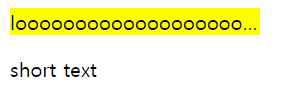
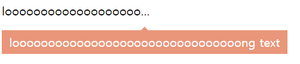

### 1. text overflow가 발생한 요소의 background를 바꿔보기

```typescript
import {AfterViewChecked, Directive, ElementRef, Renderer2} from '@angular/core';

@Directive({
  selector: '[appTextOverflow]'
})
export class TextOverflowDirective implements AfterViewChecked {
  constructor(
    private elementRef: ElementRef,
    private renderer: Renderer2
  ) { }

  ngAfterViewChecked() {
    const el = this.elementRef.nativeElement;
    const isOverflow = el.scrollWidth > el.clientWidth;
    if (isOverflow) {
      this.renderer.setStyle(el, 'background', 'yellow');
    }
  }
}

```

`ElementRef`는 디렉티브가 적용되는 DOM 엘리먼트를 참조할 수 있게 해줍니다. `ElementRef`의 `nativeElement` 프로퍼티를 참조하면 호스트 DOM 엘리먼트에 직접 접근할 수 있습니다.

`scrollWidth`는 넘쳐서 화면에 표시되지 않는 부분을 포함한 width입니다. `clientWidth`는 요소의 안쪽 치수를 픽셀 단위로 표시합니다. 패딩은 포함되지만, 마진이나 테두리는 포함되지 않습니다. `scrollWidth`가 `clientWidth` 보다 큰지 확인하는 것으로 text overflow가 발생했는지 알아낼 수 있습니다.

`Reneder2`는 DOM을 건드리지 않고 element를 수정할 수 있게 해 줍니다. 여기서는 overflow가 발생했을 때 백그라운드 색을 바꿔보았습니다.



### 2. text overflow가 발생하면 tooltip 보여주기

```typescript
import {
  AfterViewChecked,
  ComponentFactory, ComponentFactoryResolver,
  ComponentRef,
  Directive,
  ElementRef, HostListener, OnDestroy,
  ViewContainerRef
} from '@angular/core';
import { TooltipComponent } from '../component/tooltip/tooltip.component';

@Directive({
  selector: '[appTextOverflowTooltip]'
})
export class TextOverflowTooltipDirective implements AfterViewChecked, OnDestroy {
  componentRef: ComponentRef<TooltipComponent>;
  componentFactory: ComponentFactory<TooltipComponent>;
  isOverflow: boolean;
  text: string;

  constructor(
    private viewContainerRef: ViewContainerRef,
    private elementRef: ElementRef,
    private componentFactoryResolver: ComponentFactoryResolver
  ) { }

  ngAfterViewChecked() {
    const el = this.elementRef.nativeElement;
    this.isOverflow = el.scrollWidth > el.clientWidth;
    if (this.isOverflow) {
      this.text = el.innerText;
      this.componentFactory = this.componentFactoryResolver.resolveComponentFactory(TooltipComponent);
    }
  }

  ngOnDestroy() {
    this.componentRef?.destroy();
  }

  @HostListener('mouseover') onMouseOver() {
    if (this.isOverflow) {
      this.componentRef = this.viewContainerRef.createComponent(this.componentFactory);
      this.componentRef.instance.text = this.text;
    }
  }

  @HostListener('mouseleave') onMouseLeave() {
    if (this.componentRef) {
      this.viewContainerRef.clear();
    }
  }
}

```

이번에는 text overflow인 요소에 마우스를 올렸을 때 tooltip이 표시되도록 하는 directive를 만들어보았습니다. overflow여부를 확인하는 방법은 위와 동일합니다. 마우스 hover는 `HostListner`로 `mouseover`와 `mouseleave` 이벤트를 연결하는 것으로 구현할 수 있습니다. 이제 overflow일 때 동적으로 tooltip 컴포넌트를 보여주기만 하면 됩니다!

동적으로 컴포넌트를 삽입할 때, 삽입할 위치를 Angular에게 알려주어야 합니다. `viewContainerRef`는 새로운 요소를 호스트 엘리먼트의 형제 요소로 넣을 수 있는 container를 의미합니다. `ViewContainerRef.createComponent()`는 컴포넌트 인스턴스를 반환하고, 컨테이너에 뷰를 삽입합니다. 이 컴포넌트 인스터스를 통해서 컴포넌트에 값을 넣어줄 수 있습니다. 여기서는 툴팁에서 보여줘야 하는 text를 입력해주었습니다. ( `this.componentRef.instance.text = this.text`)

 `ViewContainerRef.createComponent()`는 `componentFactory` 타입을 인자로 받기 때문에 이걸 먼저 만들어 주어야합니다.  `ComponentFactoryResolver.resolveComponentFactory()`에 컴포넌트를 인자로 넘겨주면 `ComponentFactory` 타입의 컴포넌트 인스턴스가 생성됩니다. 

마우스가 요소를 벗어나면  `ViewConatinerRef.clear()`로 컨테이너의 뷰를 지워줍니다. 




코드는 https://github.com/dasom0801/angular-study/tree/master/overflow-directive/src/app 에서 확인할 수 있습니다.


>참고
>
>[앵귤러- 어트리뷰트 디렉티브](https://angular.kr/guide/attribute-directives)/ [앵귤러 - 구조 디렉티브](https://angular.kr/guide/structural-directives)/ [앵귤러 - 동적 컴포넌트](https://angular.kr/guide/dynamic-component-loader)/ [mdn - Element.scrollWidth](https://developer.mozilla.org/ja/docs/Web/API/Element/scrollWidth)/ [mdn - Element.clientWidth](https://developer.mozilla.org/en-US/docs/Web/API/Element/clientWidth)/ [Using Renderer2 in Angular](https://alligator.io/angular/using-renderer2/)/ [Understanding ViewContainerRef in Angular 2](https://netbasal.com/angular-2-understanding-viewcontainerref-acc183f3b682)

